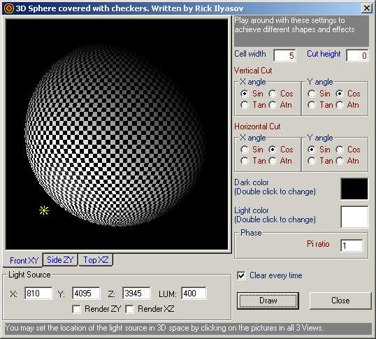



## Three Dee Vee Bee

### Description

Demonstrates Basic 3D rendering with light source.

This is not the fastest rendering. To achieve a faseter rendering APIs must be used, but the make this code more complicated and harder to read. I Hope you enjoy it. And if you like it, please VOTE! :) THANK YOU ALL VERY MUCH!
 
### More Info
 

             |
---                |---
**Submitted On**   |2002-07-23 11:56:12
**By**             |[Rick Ilyasov](https://github.com/Planet-Source-Code/PSCIndex/blob/master/ByAuthor/rick-ilyasov.md)
**Level**          |Advanced
**User Rating**    |5.0 (15 globes from 3 users)
**Compatibility**  |VB 6\.0
**Category**       |[Graphics](https://github.com/Planet-Source-Code/PSCIndex/blob/master/ByCategory/graphics__1-46.md)
**World**          |[Visual Basic](https://github.com/Planet-Source-Code/PSCIndex/blob/master/ByWorld/visual-basic.md)
**Archive File**   |[Three\_Dee\_1096077232002\.zip](https://github.com/Planet-Source-Code/rick-ilyasov-three-dee-vee-bee__1-37193/archive/master.zip)

